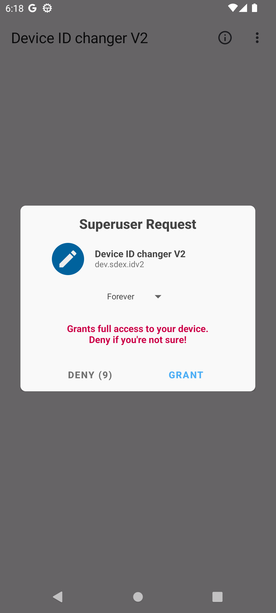
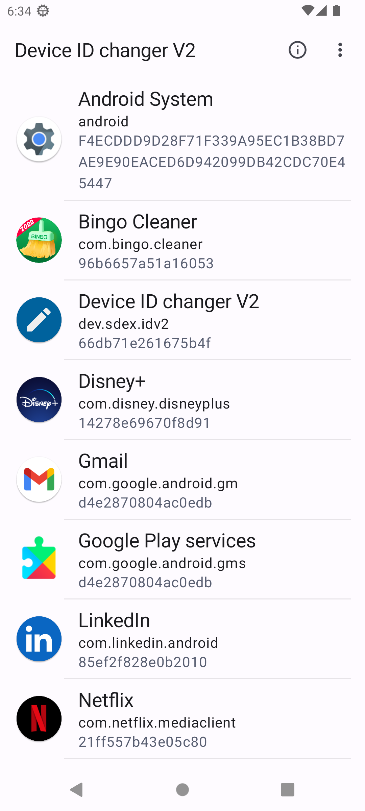
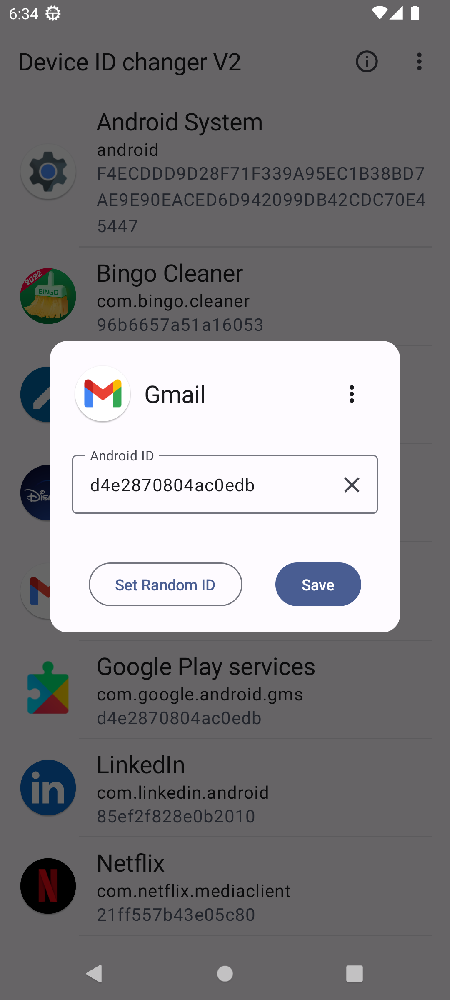

# Device ID Changer for Android [ROOT]

**The Android application to change Android device ID values using root permission.**

**The app supports all Android versions from 8 to 14**

|  |  |  |
|---|---|---|

## Get the app

The app is available as a one-time purchase: 
- [buymeacoffee.com](http://bit.ly/3YKEt01)
- [USDT/USDC/BUSD](https://github.com/sdex/AndroidIDeditorV2/blob/main/FAQ.md#other-payment-methods)

The link to download the app will be sent to the specified email.

Or subscribe to the Telegram channel and download the app:
- [open Telegram channel](https://t.me/+9y7jJGS5NM5iMTgy)

## Demo app

The demo app is available to check compatibility. \
[Read more and download](https://github.com/sdex/AndroidIDeditorV2/releases)

## Features

- List all applications with their Device ID
- Change the ID for a particular application
- Built-in random ID generator
- Validate the ID to prevent a potential system corruption
- Copy/Backup/Restore the device ID
- Export the applications list with IDs to a CSV file

## Extra features

- [Change ID without reboot](https://github.com/sdex/AndroidIDeditorV2/blob/main/WithoutReboot.md)

## Usage 

See [Usage.md](Usage.md)

## Report an issue

You can send an email from the app with the application logs, the `settings_ssaid.xml` file, and some device information that could help identify and fix the issue:
1. Click on the three dots icon at the top right corner and then select "Report an issue". 
2. Choose your email client, and write a message if you have something to add. 
3. Send the email. 

## More information

[How to change ANDROID_ID on Android 8+ (Oreo) with ROOT](https://medium.com/@sdex/how-to-change-android-id-on-oreo-with-root-a71ebbc38cec) \
[Read and edit Android Binary XML (ABX) files](https://blog.sdex.dev/ABX/) \
[XDA thread](https://xdaforums.com/t/android-8-0-root-android-device-id-shanger.3896146/)

## Denial of responsibility

Anything you do is at your own risk. No one else is responsible for any data loss, corruption, or damage to your device, including that which results from bugs in this software. There is a nonzero chance of any of these events happening due to using the tools or methods here. Always make backups. 
