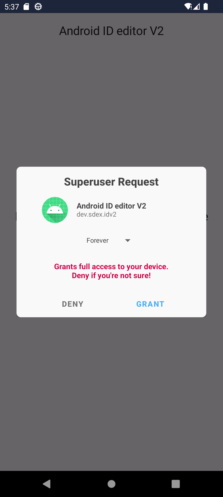
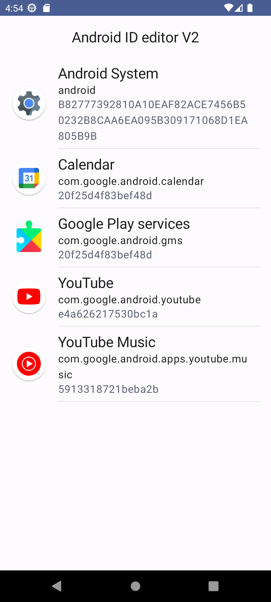

# Device ID changer for Android 12+

**The Android application changes Android device ID values using root permission.**

The app is available as one-time purchase: 
- [buymeacoffee.com](http://bit.ly/3YKEt01) (free for supporters)

## Features
- List all applications with their personal Device ID
- Change the ID for a particular application
- Built-in random ID generator
- Validate the ID to prevent a potential system corruption
- Copy/Backup/Restore the device ID
- Export the applications list with IDs to a CSV file

## Denial of responsibility

Anything you do is at your own risk. No one else is responsible for any data loss, corruption, or damage to your device, including that which results from bugs in this software. There is a nonzero chance of any of these events happening due to using the tools or methods here. Always make backups. 

## Usage 

**Backup the file `/data/system/users/0/settings_ssaid.xml`. \
Corrupting this file may end up in a bootloop. Make sure you can recover the device beforehand.** 

The app is tested on Android 12, and 13 with Magisk 25.2.

Changing the ID for an app: 
1. Install "Android ID editor V2" app.
2. Launch the editor and grant superuser permission. 
3. Choose an app you want to edit the ID from the list. 
4. Enter a new ID or generate a random one. The ID must contain 16 digits or letters from A to F. It's case-insensitive. 
5. Click "Save" to write the new ID. 
6. Repeat steps 3-5 for other apps if need to. 
7. Reboot your device to apply the changes. 

|  |  |  |
|---|---|---|

## Report an issue

You can send an email from the app with the application logs, `settings_ssaid.xml` file, and some device information that could help identify and fix the issue:
1. Click on the three dots icon at the top right corner and then select the "Report an issue". 
2. Choose your email client, and write a message if you have something to add. 
3. Send the email. 

## Technical details

Starting from Android 8.0 the system creates a unique ID for each application when it's requested:

```kotlin
val androidId = Settings.Secure.getString(  
    context.contentResolver,  
    Settings.Secure.ANDROID_ID  
)
```

The OS stores all these IDs in a special file located at: 

```
/data/system/users/0/settings_ssaid.xml
```

Prior to Android 12, the file was in XML format. In Android 12 the system started to use a special binary format to store the data. \
More information you can find in these articles: \
[Briefly about Android ABX](https://blog.sdex.dev/ABX/) \
[Android ABX – Binary XML](https://www.cclsolutionsgroup.com/post/android-abx-binary-xml) \
[How to change ANDROID_ID on Android 8+ (Oreo) with ROOT](https://medium.com/@sdex/how-to-change-android-id-on-oreo-with-root-a71ebbc38cec) 
