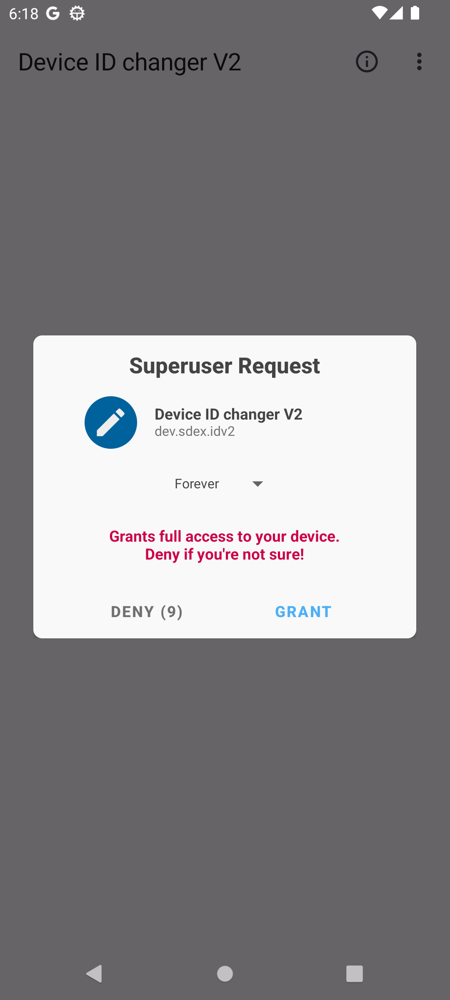
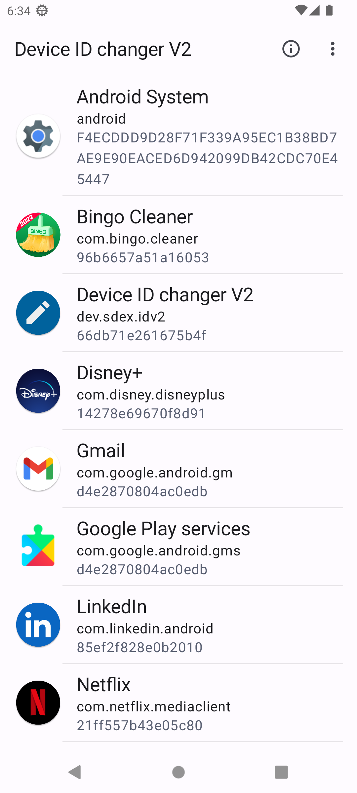
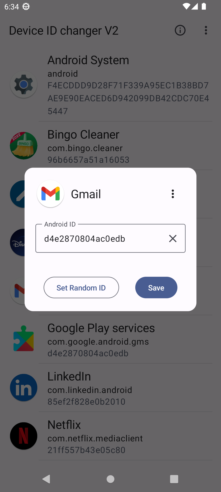

# Device ID Changer for Android [ROOT]

**The Android application to change Android device ID values using root permission.**

**The app supports Android versions from 8 to 16**

**The plugin to apply changes without reboot supports Android versions from 10 to 16**

|  |  |  |
|---|---|---|

## Get the app

The app is available as a one-time purchase for $3: 
- [pay with crypto BTC/ETH/USDT/other](https://github.com/sdex/AndroidIDeditorV2/blob/main/FAQ.md#other-payment-methods)

The link to download the app will be sent to the specified email.

Or get the app using Telegram stars:
- [open Telegram channel](https://t.me/+9y7jJGS5NM5iMTgy)

## Demo app

The demo app is available to check compatibility. \
[Read more and download](https://github.com/sdex/AndroidIDeditorV2/releases)

## Features

- List all applications with their Device ID
- Change the ID for a particular application
- Built-in random ID generator
- Validate the ID to prevent a potential system corruption
- Copy/Backup/Restore the device ID
- Export the applications list with IDs to a CSV file
- Multi-user support

## Extra features

- [Change ID without reboot](https://github.com/sdex/AndroidIDeditorV2/blob/main/WithoutReboot.md)

## Usage

See [Usage.md](Usage.md)

## Troubleshooting

See [Troubleshooting.md](Troubleshooting.md)

## More information

[How to change ANDROID_ID on Android 8+ (Oreo) with ROOT](https://medium.com/@sdex/how-to-change-android-id-on-oreo-with-root-a71ebbc38cec) \
[Read and edit Android Binary XML (ABX) files](https://blog.sdex.dev/ABX/) \
[XDA thread](https://xdaforums.com/t/android-8-0-root-android-device-id-shanger.3896146/)

## Denial of responsibility

Anything you do is at your own risk. No one else is responsible for any data loss, corruption, or damage to your device, including any resulting from bugs in this software. There is a nonzero chance that any of these events will occur as a result of using the tools or methods here. Always make backups. 
