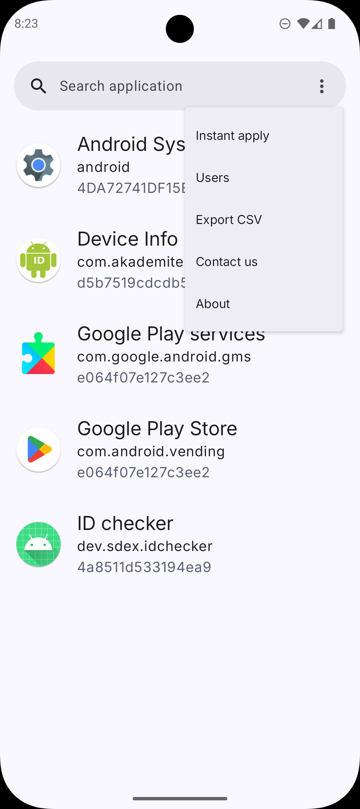
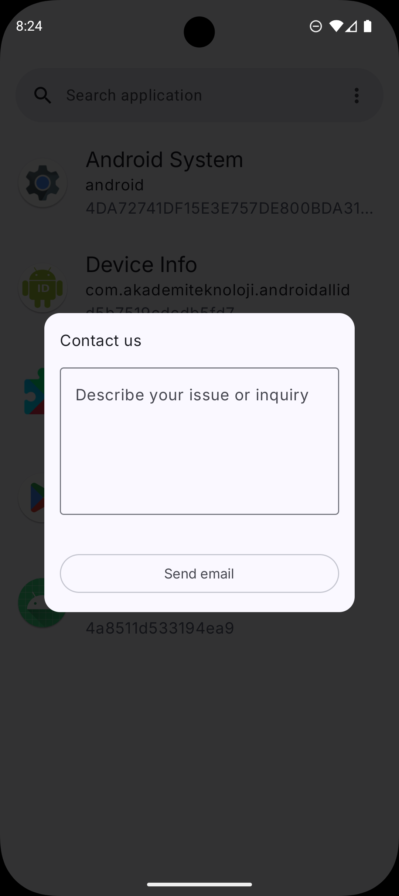

### The app requires root permission; it won't work without it.

AndroidIDeditor does not automatically collect and send any information. \
The only way to report the issue is to send the app's logs from the app: 
1. Click on the three dots icon at the top right corner and then select "Contact us". 
2. Write a message describing the issue. 
3. Send the email with the attached file.

|  |  |
|---|---|
