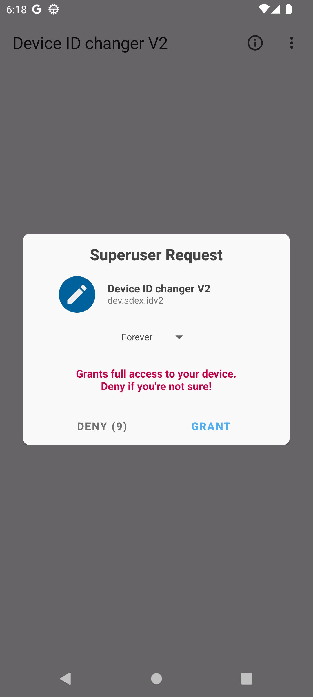
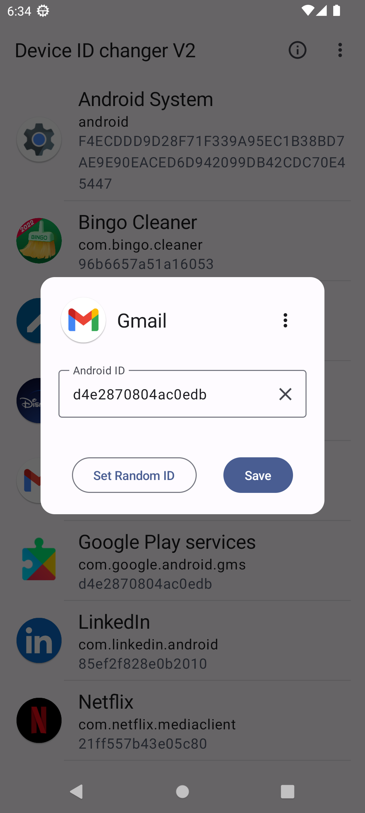

## Usage 

1. Install the "Device ID Changer" app.
2. Launch the app and grant the superuser permission. 
3. Choose an app you want to edit the ID from the list. 
4. Enter a new ID or generate a random one. The ID must contain 16 digits or letters from A to F. It's case-insensitive. 
5. Click "Save" to write the new ID. 
6. Repeat steps 3-5 for other apps if need to. 
7. Reboot your device to apply the changes. 

|  |  |  |
|---|---|---|
